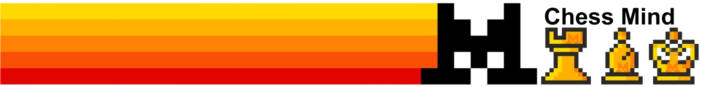

# Chess-mind



Chess-mind est une application web basée sur un **MCP Mistral** pour l'analyse de parties d'échecs, la gestion de tournois, et l'intégration Discord. Elle propose plusieurs microservices accessibles via FastAPI.
Ce projet a été réalise lors du hackaton **Mistral AI MCP Hackathon** organisé par Mistral et cerebral valley.

## Fonctionnalités

- **Analyse de parties d'échecs** : Récupère et analyse la dernière partie d'un joueur Chess.com.
- **Tournois d'échecs** : Liste les tournois à venir en France avec détails (nom, dates, organisateur, etc.).
- **Bot Discord** : Envoie des annonces automatiques sur un serveur Discord via webhook.

## Structure du projet

```
.
├── bot_discord.py         # Intégration Discord (webhook)
├── echo_server.py         # Microservice d'analyse et tournois d'échecs
├── math_server.py         # Microservice d'opérations mathématiques
├── server.py              # Serveur principal FastAPI
├── requirements.txt       # Dépendances Python
├── Dockerfile             # Conteneurisation du projet
├── assets/
│   └── logo.png           # Logo du projet
├── static/
│   └── embed.png          # Image statique
├── templates/
│   └── index.html         # Page d'accueil web
```

## Installation

1. **Cloner le dépôt**
	```sh
	git clone https://github.com/Antoine0703/Chess-mind.git
	cd Chess-mind
	```

2. **Installer les dépendances**
	```sh
	pip install -r requirements.txt
	```

3. **Configurer le webhook Discord**
	- Créer un fichier `.env` à la racine :
	  ```
	  DISCORD_WEBHOOK_URL=<votre_webhook_url>
	  ```

4. **Lancer le serveur**
	```sh
	python server.py
	```
	Le serveur démarre sur le port `10000` par défaut.

## Utilisation

- Accéder à l'interface web : [http://localhost:10000](http://localhost:10000)
- Endpoints API :
  - `/echo` : Services d'échecs (analyse, tournois)
  - `/math` : Services mathématiques
  - `/static` : Fichiers statiques

## Docker

Pour lancer le projet dans un conteneur :
```sh
docker build -t chess-mind .
docker run -p 10000:10000 chess-mind
```
